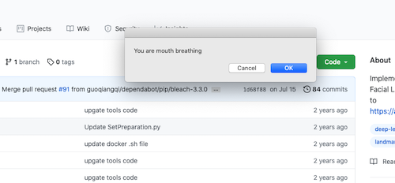

# Nose Breathing Trainer 

Implementation of a nose breathing trainer to run in the background while you work at your computer. 

Runs on MacOS and Linux.  

<br/>


## What does it do?
Want to stop absent mindedly mouth breathing while you work? Then this nose breathing trainer is for you. Never worry about if you're mouth breathing because Nose Breathing Trainer will alert you when you're mouth breathing 😮‍💨.  

<br/>

## How to use
Make sure you have python3 and a webcam installed on your system. 

Create a virtualenv. Then run ```pip install -r requirements.txt```

Then run ```python nose-breathing-trainer.py```. 

Your camera will turn on, and you'll get notifications when you start nose breathing (see below).



<br/>

## Advanced
If you touch your face a lot, that can trigger a false positive.

You can tweak the sensitivity of the alerts on line 88 of nose-breathing-trainer.py. 

<br/>

## Acknowledgements
The original models and script came from [Pytorch Face Landmark](https://github.com/cunjian/pytorch_face_landmark).
